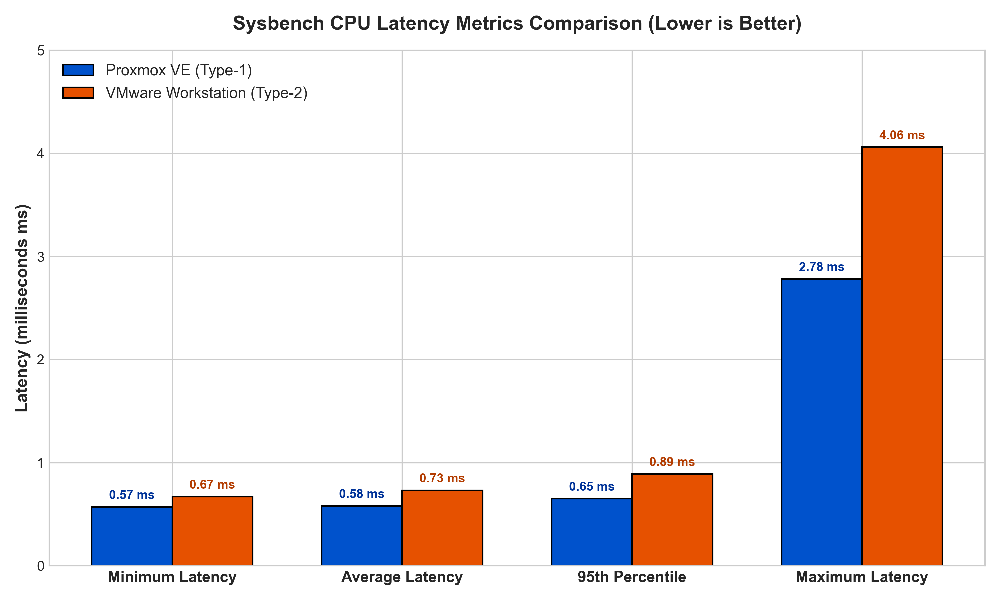

# Laboratory Report
## Comparing CPU Performance Under Type-1 and Type-2 Hypervisors

**Course:** Cloud Computing / Computer Networks Laboratory
**Experiment No.:** 1
**Title:** CPU Benchmark Comparison of Proxmox VE (Type-1) and VMware Workstation (Type-2)

---

## Table of Contents

1. [Aim](#1-aim)
2. [Background Theory](#2-background-theory)
3. [Setup and Specifications](#3-setup-and-specifications)
4. [Procedure](#4-procedure)
5. [Observations](#5-observations)
6. [Side-by-Side Comparison](#6-side-by-side-comparison)
7. [Graphs](#7-graphs)
8. [Analysis and Discussion](#8-analysis-and-discussion)
9. [Conclusion](#9-conclusion)

---

## 1. Aim

This experiment aims to:

1. Set up two Ubuntu virtual machines with matching configurations, one on each hypervisor type:
   - **Type-1 (bare-metal):** Proxmox VE
   - **Type-2 (hosted):** VMware Workstation Pro
2. Run a CPU stress test on each VM using `sysbench` with `--cpu-max-prime=20000`.
3. Record the total run time, number of events, events per second (throughput), and the minimum, average, maximum, and 95th-percentile latency.
4. Compare the two sets of results and explain how hypervisor design and the extra host-OS layer affect performance.

---

## 2. Background Theory

### 2.1 Type-1 Hypervisors (Bare-Metal)

A Type-1 hypervisor is installed straight onto the physical machine and manages the hardware itself, with no general-purpose operating system underneath.

- **Common examples:** Proxmox VE (built on KVM), VMware ESXi, Hyper-V (Core), Xen.
- **Layering:**

  ```text
  [ Guest VM (Ubuntu) ]
            │
            ▼
  [ Proxmox VE (KVM kernel module) ]
            │
            ▼
  [ Physical hardware: CPU, RAM, disk ]
  ```

- **Strengths:** Very little virtualization overhead, since hardware extensions (Intel VT-x / AMD-V) give the guest near-direct access to the CPU. This results in high throughput, low latency, and good scalability for enterprise use.

### 2.2 Type-2 Hypervisors (Hosted)

A Type-2 hypervisor is an ordinary application that runs inside an existing host operating system.

- **Common examples:** VMware Workstation, Oracle VirtualBox, Parallels Desktop.
- **Layering:**

  ```text
  [ Guest VM (Ubuntu) ]
            │
            ▼
  [ VMware Workstation (application) ]
            │
            ▼
  [ Host OS (Windows 11) ]
            │
            ▼
  [ Physical hardware: CPU, RAM, disk ]
  ```

- **Strengths:** Simple to install, has a friendly graphical interface, integrates well with the desktop, and offers flexible networking choices.
- **Weaknesses:** More CPU overhead per instruction, competition with the host OS for resources, and longer context-switch delays.

---

## 3. Setup and Specifications

### Virtual Machine Configuration

Both VMs were given the same resource limits:

| Parameter | Proxmox VE (Type-1) | VMware Workstation (Type-2) |
| :--- | :--- | :--- |
| **VM Name** | `CC-Experiment1-type1` | `CC-Experiment1-Type2` |
| **VM ID / Hostname** | `123` | `janzz-virtual-machine` |
| **Guest OS** | Ubuntu 24.04.3 LTS (AMD64) | Ubuntu Linux 64-bit |
| **vCPUs** | 2 (1 socket, 2 cores) | 2 (1 processor, 2 cores) |
| **CPU Model** | x86-64-v2-AES | Default / Passthrough |
| **RAM** | 2048 MiB (2 GB) | 2048 MB (2 GB) |
| **Virtual Disk** | 20 GB (VirtIO SCSI) | 20 GB (NVMe / single-file SCSI) |
| **Network** | VirtIO bridge (`vmbr0`) | NAT (`VMnet8`) |

---

## 4. Procedure

### Part A: Proxmox VE (Type-1)

1. Open the Proxmox web console at `https://10.11.0.252:8006`.
2. Choose **Create VM**, then enter VM ID `123` and the name `CC-Experiment1-type1`.
3. Mount the Ubuntu ISO and set 2 CPU cores, 2048 MiB RAM, and a 20 GB disk.
4. Start the VM, finish installing Ubuntu, and confirm the system details with:

   ```bash
   hostnamectl
   lscpu
   free -h
   df -h
   top
   ```

5. Install Sysbench and start the benchmark:

   ```bash
   sudo apt update && sudo apt install sysbench -y
   sysbench cpu --cpu-max-prime=20000 run
   ```

### Part B: VMware Workstation (Type-2)

1. Start VMware Workstation on the Windows host.
2. Choose **Create a New Virtual Machine** → **Typical**.
3. Point the wizard at the Ubuntu ISO file.
4. Name the VM `CC-Experiment1-Type2` and pick a storage location.
5. Set a 20 GB disk, then customize the hardware to 2 vCPUs, 2 GB RAM, and NAT networking.
6. Boot the VM, install Ubuntu, and check the configuration (`lscpu`, `free -h`).
7. Install Sysbench and start the benchmark:

   ```bash
   sudo apt update && sudo apt install sysbench -y
   sysbench cpu --cpu-max-prime=20000 run
   ```

---

## 5. Observations

### Raw Sysbench Results

#### 1. Proxmox VE (Type-1)

```text
CPU speed:
    events per second: 1716.69

General statistics:
    total time: 10.0004s
    total number of events: 17169

Latency (ms):
    min: 0.57
    avg: 0.58
    max: 2.78
    95th percentile: 0.65
    sum: 9996.45

Threads fairness:
    events (avg/stddev): 17169.0000/0.00
    execution time (avg/stddev): 9.9965/0.00
```

#### 2. VMware Workstation (Type-2)

```text
CPU speed:
    events per second: 1364.78

General statistics:
    total time: 10.0007s
    total number of events: 13650

Latency (ms):
    min: 0.67
    avg: 0.73
    max: 4.06
    95th percentile: 0.89
    sum: 9992.11

Threads fairness:
    events (avg/stddev): 13650.0000/0.00
    execution time (avg/stddev): 9.9921/0.00
```

---

## 6. Side-by-Side Comparison

| Metric | Proxmox VE (Type-1) | VMware Workstation (Type-2) | Difference | Comment |
| :--- | :---: | :---: | :---: | :--- |
| **Run Time** | **10.0004 s** | **10.0007 s** | 0.0003 s | Both used the fixed 10 s window |
| **Total Events** | **17,169** | **13,650** | **+3,519** | **Proxmox completed 25.78% more work** |
| **Events/sec** | **1,716.69** | **1,364.78** | **+351.91** | **Proxmox throughput 25.78% higher** |
| **Min Latency** | **0.57 ms** | **0.67 ms** | **−0.10 ms** | **14.93% lower on Proxmox** |
| **Avg Latency** | **0.58 ms** | **0.73 ms** | **−0.15 ms** | **20.55% lower on Proxmox** |
| **95th Percentile Latency** | **0.65 ms** | **0.89 ms** | **−0.24 ms** | **26.97% lower on Proxmox** |
| **Max Latency** | **2.78 ms** | **4.06 ms** | **−1.28 ms** | **31.53% lower on Proxmox** |

---

## 7. Graphs

### Figure 1: CPU Throughput (Events per Second)


### Figure 2: Latency Comparison



### Figure 3: Total Events Completed


---

## 8. Analysis and Discussion

### 8.1 Throughput

Sysbench counts how many prime-number computations finish within 10 seconds. Proxmox VE finished 17,169 events (1,716.69 per second), against 13,650 events (1,364.78 per second) on VMware Workstation.

**Relative gain:**

$$
\text{Gain} = \frac{1716.69 - 1364.78}{1364.78} \times 100\% = 25.78\%
$$

### 8.2 Latency and Overhead

- **Average latency:** Each event took about 0.58 ms on Proxmox VE and about 0.73 ms on VMware Workstation, a penalty of roughly 0.15 ms.
- **Likely causes:**
  1. **Scheduling by the host OS:** On a Type-2 hypervisor, the VM's CPU work is scheduled by Windows alongside every other process, which introduces waiting time.
  2. **Extra privilege transitions:** Proxmox uses KVM, which runs guest code directly on the CPU in hardware-assisted mode. This avoids much of the intermediate switching that a hosted setup incurs.

---

## 9. Conclusion

1. The Type-1 hypervisor (Proxmox VE) delivered clearly better CPU performance, with about 25.78% higher throughput and about 20.55% lower average latency than the Type-2 hypervisor (VMware Workstation).
2. The additional software layer and the competition for resources with the host OS explain the weaker benchmark numbers on the Type-2 setup.
3. **Recommendation:** Type-1 hypervisors suit production cloud environments, while Type-2 hypervisors are better for local development and testing.

---

**Student Signature:** ____________________
**Date of Submission:** September 22, 2026
**Evaluation Grade:** ________ / ________
