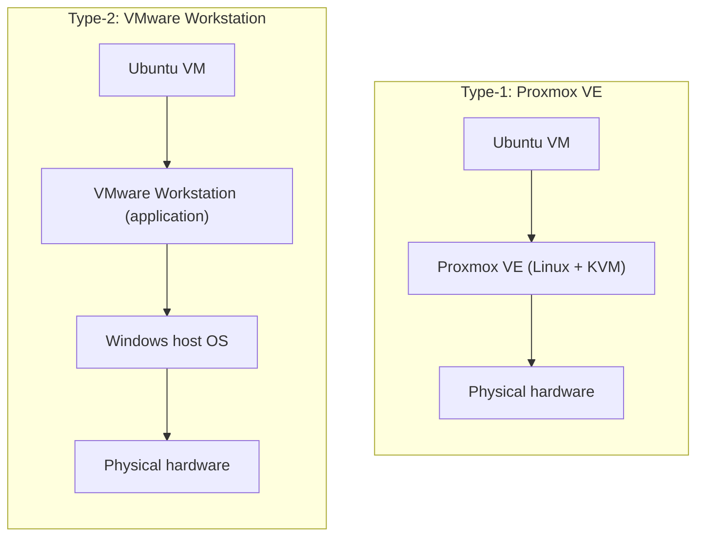

# CC-Experiment_01: Performance Analysis of Type-1 and Type-2 Hypervisors


## Summary

This repository documents a lab study comparing CPU performance on a **Type-1 (bare-metal) hypervisor, Proxmox VE**, and a **Type-2 (hosted) hypervisor, VMware Workstation**. It contains the setup steps, raw benchmark results, charts, and the written analysis.

An Ubuntu VM with identical specs (2 vCPUs, 2 GB RAM, 20 GB disk) was created on each platform, and the `sysbench` prime-number CPU test (`--cpu-max-prime=20000`) was run on both under the same conditions.

> **Headline result:** Proxmox VE reached 1,716.69 events/sec against 1,364.78 on VMware Workstation, about 25.8% more throughput, with 20.55% lower average latency.

## Contents

1. [Objectives](#1-objectives)
2. [Architecture](#2-architecture)
3. [VM Specifications](#3-vm-specifications)
4. [Procedure](#4-procedure)
5. [Results](#5-results)
6. [Analysis](#6-analysis)
7. [Conclusion](#7-conclusion)
8. [Repository Layout and Reproduction](#8-repository-layout-and-reproduction)

---

## 1. Objectives

1. **Deploy** two matching Ubuntu VMs on different hypervisor designs: Proxmox VE (Type-1, KVM-based) and VMware Workstation Pro on a Windows host (Type-2).
2. **Keep resources equal** so the comparison is fair.
3. **Benchmark** CPU virtualization efficiency using `sysbench` with primes up to 20,000.
4. **Collect metrics:** run time, total events, throughput, and latency (min, avg, 95th percentile, max).
5. **Measure overhead:** determine what the host-OS layer under a Type-2 hypervisor costs compared with running directly on hardware.

---

## 2. Architecture

The two setups differ in one key way: a Type-2 hypervisor has a full host operating system between it and the hardware.



- **Type-1:** Proxmox VE runs directly on the machine. Its KVM-enabled Linux kernel is the hypervisor, and guest instructions execute on the CPU through Intel VT-x / AMD-V.
- **Type-2:** VMware Workstation is an ordinary application. Guest CPU requests go through VMware's virtual machine monitor, are translated into host OS calls, and are scheduled by the Windows NT kernel before reaching the hardware.

---

## 3. VM Specifications

| Parameter | Proxmox VE (Type-1) | VMware Workstation (Type-2) |
| :--- | :--- | :--- |
| **VM name** | `CC-Experiment1-type1` | `CC-Experiment1-Type2` |
| **VM identifier** | `VMID 123` | `janzz-virtual-machine` |
| **Guest OS** | Ubuntu 24.04.3 LTS (AMD64) | Ubuntu Linux 64-bit |
| **vCPUs** | 2 (1 socket, 2 cores) | 2 (1 processor, 2 cores) |
| **CPU model** | `x86-64-v2-AES` | Host passthrough / default |
| **RAM** | 2048 MiB | 2048 MB |
| **Virtual disk** | 20 GB | 20 GB |
| **Network** | VirtIO (`vmbr0`) | NAT (`VMnet8`) |
| **Benchmark tool** | `sysbench 1.0.20` | `sysbench 1.0.20` |

---

## 4. Procedure

### Step 1: Create the VMs

**Proxmox VE (Type-1)**
- Opened `https://10.11.0.252:8006` in a browser and started the `Create VM` wizard (VM ID `123`, name `CC-Experiment1-type1`).
- Attached the Ubuntu 24.04 ISO and assigned 2 cores, 2048 MiB RAM, a 20 GB VirtIO disk, and the `vmbr0` bridge.
- Completed the Ubuntu installation.

**VMware Workstation (Type-2)**
- Opened VMware Workstation on the Windows host and chose the `Typical` path.
- Selected the Ubuntu ISO, named the VM `CC-Experiment1-Type2`, and set a 20 GB disk.
- Configured 1 processor with 2 cores, 2 GB RAM, and a NAT adapter, then completed the installation.

### Step 2: Check the Configuration

Run inside each guest before benchmarking:

```bash
hostnamectl   # hostname and architecture
lscpu         # CPU topology
free -h       # memory
df -h         # disk capacity
top           # live load
```

### Step 3: Install and Run Sysbench

```bash
sudo apt update && sudo apt install sysbench -y
sysbench --version
sysbench cpu --cpu-max-prime=20000 run
```

---

## 5. Results

### Benchmark Output

| Proxmox VE (Type-1) | VMware Workstation (Type-2) |
| :---: | :---: |
|  |  |

### Measured Values

| Metric | Proxmox VE (Type-1) | VMware Workstation (Type-2) | Difference |
| :--- | :---: | :---: | :---: |
| **Run time** | 10.0004 s | 10.0007 s | ~0.003% |
| **Total events** | **17,169** | 13,650 | +3,519 (+25.78%) |
| **Events/sec** | **1,716.69** | 1,364.78 | +351.91 (+25.79%) |
| **Min latency** | **0.57 ms** | 0.67 ms | −0.10 ms (−14.93%) |
| **Avg latency** | **0.58 ms** | 0.73 ms | −0.15 ms (−20.55%) |
| **95th percentile latency** | **0.65 ms** | 0.89 ms | −0.24 ms (−26.97%) |
| **Max latency** | **2.78 ms** | 4.06 ms | −1.28 ms (−31.53%) |

Bold marks the better value in each row. Throughput and total events are better when higher; all latency figures are better when lower.

### Charts

Throughput and latency are shown below. The total-events figure follows the same ratio as throughput because the test window is fixed, so it is not charted separately.


---

## 6. Analysis

Proxmox VE outperformed VMware Workstation on this CPU-bound workload for three main reasons.

**Virtualization overhead.** Proxmox VE uses Linux KVM with the Intel VT-x / AMD-V extensions, so guest instructions run with very little hypervisor interference. VMware Workstation handles privileged guest operations twice: once in VMware's virtual machine monitor and again in the Windows kernel through user-to-kernel transitions (`NtSystemService`).

**Scheduling.** On Proxmox VE, each vCPU is a normal Linux thread managed by the Completely Fair Scheduler. On VMware Workstation, the guest competes with Windows background activity such as Windows Defender, update services, and the Desktop Window Manager. Host preemption produces latency spikes, which is why max latency was 4.06 ms on VMware versus 2.78 ms on Proxmox.

**Memory translation.** Proxmox VE relies on hardware-assisted address translation (EPT / NPT). A Type-2 setup adds cost along the path Guest Physical → Host Virtual → Host Physical address.

---

## 7. Conclusion

1. **Bare metal is faster:** Proxmox VE delivered about 25.8% higher CPU throughput and 20.55% lower average latency.
2. **Response times are steadier:** the 95th percentile latency was 0.65 ms versus 0.89 ms, which matters for latency-sensitive systems.
3. **Where to use each:**
   - **Type-1 (Proxmox VE, KVM, ESXi):** cloud data centers, production infrastructure, database servers, and high-performance computing.
   - **Type-2 (VMware Workstation, VirtualBox):** local development, testing, desktop sandboxes, and teaching labs.

---

## 8. Repository Layout and Reproduction

```text
Cloud_computing/
├── README.md                # Project overview (this file)
├── LAB_REPORT.md            # Formal lab report for submission
├── images/                  # Screenshots and charts
│   ├── 1.png                # Proxmox VE Sysbench screenshot
│   ├── 2.png                # VMware Workstation Sysbench screenshot
│   ├── events_per_second_comparison.png
│   └── latency_comparison.png
└── scripts/
    ├── benchmark.sh         # Runs the Sysbench test
    ├── generate_plots.py    # Builds the charts with Matplotlib
    └── parse_sysbench.py    # Parses results and computes ratios
```

To reproduce the experiment:

```bash
chmod +x scripts/benchmark.sh
./scripts/benchmark.sh              # run inside each VM
python scripts/generate_plots.py    # generate charts
python scripts/parse_sysbench.py    # parse and compare results
```

---

*Conducted as a laboratory experiment for the Cloud Computing / Computer Networks course.*
